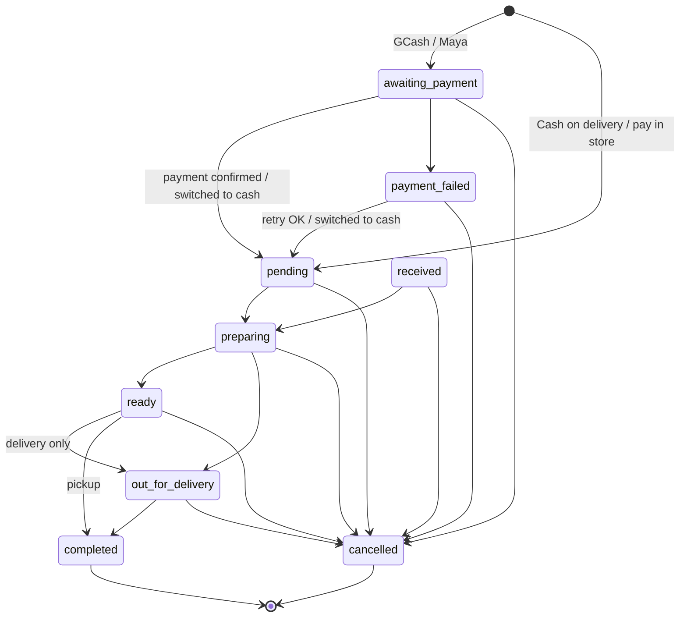

# User simulation — 17 personas + hard questions through the UI

Each persona "walks through" the system as it is on branch `more-things-to-update-yr`.
This is a **code walkthrough, not a live test**: every difficulty below was traced to real code, and the file is
named so you can check it. Items already planned in [`limitations.md`](limitations.md) or [`lacking.md`](lacking.md)
are marked **(L#)** or **(lacking)** instead of being repeated in full.

"Queries" are the SQL each persona's needs would require. They use the real table and column names
(`"order"` must be quoted because `order` is a reserved word).

---

## Top findings across all personas

| # | Finding | Who hits it | Severity |
|---|---|---|---|
| 0a | **Any signed-in customer can make themselves a manager**: RLS is off on `employee` in the live database (confirmed read-only, persona 13) | Security analyst, DBA | 🔴 Critical |
| 0b | **Pay-in-store sales are counted as ₱0 in reports**, and payment values are spelled five different ways in the live data (persona 14) | Accountant, owner | 🔴 High |
| 1 | **A signed-in customer can create orders directly in the database**, choosing their own status, order fee and item prices | QA, developer, owner, DBA | 🔴 Critical |
| 2 | Double-clicking "Place order" can create two orders | New, young, old customer | 🔴 High (L15) |
| 3 | Guests can tap "Add" but only get "You must be signed in." with no link, and their pick is lost | New, old customer | 🟠 High |
| 4 | No way to contact the store anywhere (no phone, email or chat) | Every customer, owner | 🟠 High |
| 5 | Staff can change menu prices, and nothing records who did it | Owner, manager | 🟠 High |
| 6 | About 170 text styles are 12px or smaller (3 at 9px) | Old customer, kitchen staff | 🟠 Medium |
| 7 | Only created/completed/cancelled times are stored, so prep time can't be measured | Owner, manager, DBA | 🟠 Medium (L9) |
| 8 | No database indexes on the columns every screen filters by | DBA, developer | 🟡 Medium |
| 9 | Status and type columns are free text with no allowed-values check, and old spellings exist in code | DBA, developer | 🟡 Medium |
| 10 | Generated types are out of date (`order.employee_id` was dropped but is still in `types/database.types.ts`) | Developer | 🟡 Low |
| 11 | The arrival estimate is overwritten each time it's recalculated, so ETA accuracy can never be measured | Data scientist, owner | 🟠 Medium |
| 12 | Reports only export as PDF, with no CSV or raw data | Data analyst | 🟠 Medium |
| 13 | GCash and Maya are both saved as `paymongo` | Data analyst, owner | 🟡 Medium |
| 14 | Report dates use UTC midnight, not Manila midnight. It only works because the store opens at 8 AM Manila (00:00 UTC) | Data analyst, developer | 🟡 Low (latent) |
| 15 | (Removed) | Data scientist | 🟡 Low |

Finding 1 is new and more serious than anything in `limitations.md`, so it has been added there as **L21**.

---

## 1. New customer — "Ana, 27, found the shop on Facebook"

**What she tries:** opens the site, browses, adds Yang Chow fried rice, signs up, orders.

**Difficulties**
- The home page *is* the menu, which is good. But when she taps **Add** as a guest she gets a red toast,
  "You must be signed in." (`lib/actions/cart.ts:71`, shown by `lib/cart/use-cart-action.ts`). There's no
  "Sign in" button in the toast, and nothing is remembered, so after signing up she has to find the dish again.
- Sign-up asks for 6 fields plus a terms checkbox, then an **email confirmation**, which sends her to `/login`,
  not back to the menu (`app/(auth)/actions.ts`). Four steps before she can add one item.
- She can't see the order fee until checkout, because it depends on her address. "₱50 + ₱10/km" isn't shown on the menu.
- There's no phone number or email to contact the store. The footer hides contact details because
  none are set (`lib/site/site-info.ts`).
- If she opens the site at 6:30 PM she sees "Store is currently closed. Restaurant hours are 8am - 6pm."
  She can't order ahead for tomorrow (lacking: scheduled orders).

**Features she'd want**
- Let guests build a cart, then ask them to sign in at checkout (cart saved in the browser, moved to the account on login).
- A "Sign in to add this" button in the toast that returns her to the same dish.
- 
- Contact details and store hours in the footer (L13).

**Queries needed**
```sql
-- Move a guest cart into the new account on first login (after inserting a cart row)
INSERT INTO cart_item (cart_id, product_id, quantity, special_instructions)
SELECT :new_cart_id, product_id, quantity, special_instructions
FROM jsonb_to_recordset(:guest_cart_json) AS g(product_id uuid, quantity int, special_instructions text);

-- Show "Best seller" on the menu for first-time visitors (L14)
SELECT oi.product_id, SUM(oi.quantity) AS sold
FROM order_item oi JOIN "order" o USING (order_id)
WHERE o.order_status = 'completed' AND o.created_at > now() - interval '30 days'
GROUP BY oi.product_id ORDER BY sold DESC LIMIT 3;
```

---

## 2. Regular customer — "Mark, orders lunch to the office 3× a week"

**What he tries:** the same meal as always, fast.

**Difficulties**
- Reorder exists, but only on **My Orders**. From the menu it's 3 taps away (L20).
- No favourites. He scrolls to the same 3 dishes every time.
- No loyalty points, vouchers or "10th meal free" (lacking). Nothing rewards coming back.
- If a price changed since last time, checkout doesn't point it out; it just charges the new price (L2).
- He wants to pay GCash, but if the payment page times out he has to retry from the order page.
  That flow exists and works (`switch-to-cod-button.tsx`), but wallet orders that are never paid pile up in his history (L3).
- No notifications: he has to keep the tracking page open to know the customer/courier is near (L10).

**Features he'd want**
- "Order again" at the top of the menu, favourites (heart icon), and a saved default payment method.
- Loyalty stamps (lacking), a notification bell (L10), and a receipt he can expense (L12).

**Queries needed**
```sql
-- His "Order again" row: last 3 completed orders with their items
SELECT o.order_id, o.created_at, array_agg(oi.product_name || ' ×' || oi.quantity) AS items
FROM "order" o JOIN order_item oi USING (order_id)
WHERE o.customer_id = auth.uid() AND o.order_status = 'completed'
GROUP BY o.order_id ORDER BY o.created_at DESC LIMIT 3;

-- Favourites (new table)
CREATE TABLE favorite (
  customer_id uuid REFERENCES customer ON DELETE CASCADE,
  product_id  uuid REFERENCES product  ON DELETE CASCADE,
  created_at  timestamptz DEFAULT now(),
  PRIMARY KEY (customer_id, product_id)
);

-- Loyalty stamps: completed orders since his last redeemed reward
SELECT count(*) FROM "order"
WHERE customer_id = auth.uid() AND order_status = 'completed'
  AND created_at > coalesce(:last_redeemed_at, 'epoch');
```

---

## 3. QA tester — "Paolo, tries to break things"

**What he tries:** double clicks, direct API calls, odd inputs, two tabs, bad timing.

**Bugs found**
- 🔴 **Direct database writes.** The `customer_insert_own_orders` rule on `"order"` only checks
  `customer_id = auth.uid()` (`supabase/migrations/000_remote_schema.sql:520`). `customer_insert_own_order_items`
  on `order_item` only checks that the order is his (`:542`). The Supabase URL and anon key are public by design, and his
  login token is in the browser. With those three, he can call the REST API directly and:
  - insert an order with `order_status = 'preparing'`, skipping payment,
  - set `order_fee = 0` and deliver to any address, skipping the NCR/15 km check,
  - insert `order_item` rows with `unit_price = 1`.
  No `transaction` row is created, so the order has no payment record. The kitchen queue only hides
  `awaiting_payment` and `payment_failed` (`lib/orders/kitchen-queue.ts`), so an order inserted as `preparing` would
  show up for the cooks. This hasn't been run against the live database. Confirm with one test request, then fix (**L21**).
- 🔴 The cancel rule `customer_cancel_own_orders` (`:514`) checks that the new status is `cancelled`, but not the other
  columns. In the same update he can also change `order_fee` or `` on a pending order. Low impact,
  because the order is cancelled, but reports that add up fees will be off.
- 🔴 Two fast clicks on "Place order" → two orders (L15).
- 🟠 Server allows 99 per item, the screen only 20 (L2).
- 🟠 Ordering at 3 AM works if he calls the server action directly (L1). In development the store is always open,
  so the closed state can't be tested locally.
- 🟠 An item marked sold out after he added it still goes through (L2).
- 🟡 Deleting his account while an order is out for delivery works (L16).
- 🟡 Changing his device clock changes whether the menu shows "closed", because the check runs in the browser.

**Features he'd want**
- A test mode switch for store hours (`FORCE_STORE_OPEN`), seed data for edge cases (sold-out item, archived item,
  unpaid wallet order), and a script that fires 2 checkouts at once.

**Queries needed**
```sql
-- Orders with no payment record (would catch the direct-insert hole)
SELECT o.order_id, o.created_at, o.order_status
FROM "order" o LEFT JOIN "transaction" t USING (order_id)
WHERE t.order_id IS NULL;

-- Order lines whose price doesn't match the product at the time (price tampering)
SELECT oi.order_id, oi.product_name, oi.unit_price, p.product_price
FROM order_item oi JOIN product p USING (product_id)
WHERE oi.unit_price < p.product_price * 0.5;

-- Two orders made from one cart (double submit)
SELECT c.cart_id, count(o.order_id) FROM cart c
JOIN "order" o ON o.customer_id = c.customer_id
 AND o.created_at BETWEEN c.submitted_at - interval '5 seconds' AND c.submitted_at + interval '5 seconds'
GROUP BY c.cart_id HAVING count(*) > 1;

-- Stored values nobody expected
SELECT order_status, order_type, count(*) FROM "order" GROUP BY 1, 2 ORDER BY 3 DESC;
```

---

## 4. Developer — "Kai, joins the team next sprint"

**What he tries:** clone, set up, change something, ship.

**Difficulties**
- Setup is well documented in the README. But `supabase/profile-rls-and-triggers.sql` must be run **by hand** after the
  migrations. That's easy to miss, and then new emails never reach `customer.email`.
- `types/database.types.ts` is out of date: `order.employee_id` was dropped in
  `20260926000002_drop_order_employee_id_and_customer/courier_queue_realtime.sql` but is still in the types. Code that uses it
  compiles, then fails at runtime.
- `submitCart` calls a database function `submit_cart_to_order` that **isn't in any migration**, so the code always falls
  back to a longer path. Two ways to place an order means two places to fix bugs (L15).
- Old values are still in code: `order_type` can be `take_out`, `pickup`, `dine_in` or `drive_thru`. The app shows only
  2 payment options, but the types allow 4 (`card` is commented out). There's no database check, so any spelling gets saved.
- Security rules are split across `000_remote_schema.sql`, 5 later migrations and one hand-run file. To answer "can a
  customer insert into `order`?" he has to read all of them. That's how the direct-insert hole (finding 1) went unnoticed.
- Unit tests are good (60+ files), but none run against a real database, so row-level security is untested.

**Features he'd want**
- One `npm run db:reset` that also applies the hand-run SQL file.
- A CI check that fails if the generated types differ from the database (`supabase gen types` + `git diff --exit-code`).
- An RLS test file that signs in as a customer and tries to insert, update and delete in every table.
- Allowed-values checks on status columns (see DBA below).

**Queries needed**
```sql
-- Every row-level security rule in one list (paste into the SQL editor)
SELECT tablename, policyname, cmd, roles, qual, with_check
FROM pg_policies WHERE schemaname = 'public' ORDER BY tablename, cmd;

-- Tables with security turned off
SELECT relname FROM pg_class c JOIN pg_namespace n ON n.oid = c.relnamespace
WHERE n.nspname = 'public' AND c.relkind = 'r' AND NOT c.relrowsecurity;
```

---

## 5. Young customer — "Bea, 15, orders with her own GCash"

**What she tries:** orders merienda for her barkada from her phone.

**Difficulties**
- Sign-up allows 13+, which is fine. But she **can't split the bill** or share a cart with friends (lacking: group orders).
- No vouchers or "student deals". Chain apps all push app-only promos (lacking).
- No dark mode (lacking). She uses her phone at night.
- She double-taps a lot. "Place order" can create 2 orders (L15), and GCash charges her for the one she pays.
- No sharing: she can't send her friends a link to the tracking page (it needs her login).

**Features she'd want**
- A shareable tracking link (read-only, no login), a shared cart link, student or barkada bundles, dark mode,
  and a push notification when the customer/courier is near.

**Queries needed**
```sql
-- Read-only public tracking token
ALTER TABLE "order" ADD COLUMN share_token uuid DEFAULT gen_random_uuid() UNIQUE;
-- Public page reads only safe columns:
SELECT order_status, created_at FROM "order" WHERE share_token = :token;
```

---

## 6. Old customer — "Lolo Ben, 68, has a Senior Citizen ID"

**What he tries:** orders pancit for the family, pays cash.

**Difficulties**
- 🔴 **No Senior Citizen discount** (L4). He is legally entitled to 20% off plus VAT exemption, and will call the store to
  complain. There's no number to call (finding 4).
- Small text: about 170 text styles are 12px or smaller, 3 are 9px (`grep text-\[9px\]`). Order numbers like `#69403b15` are hard
  to read aloud over the phone.
- Email confirmation: he may not know where the email went, and there's no "resend" button on the login page.
- GCash/Maya: he'll likely use cash, but there's no "change for ₱1,000" field, so the customer/courier may not have change (L8).
- Icons without words (cart, profile avatar) are hard for him to guess.
- Password rules (strength meter) are strict. "Forgot password" works, but only by email.

**Features he'd want**
- Senior/PWD discount (L4), a "Large text" toggle or a 16px minimum, a phone number to call, "change for" on cash
  orders, and a simpler order number (e.g. `YFR-0425`) that's easy to say out loud.
- Labels under icons in the bottom tab bar.

**Queries needed**
```sql
-- Short, readable order numbers
CREATE SEQUENCE order_no_seq;
ALTER TABLE "order" ADD COLUMN order_no int DEFAULT nextval('order_no_seq') UNIQUE;

-- Senior/PWD discount total for BIR reporting (after L4)
SELECT date_trunc('day', transaction_date) AS day, discount_type,
       count(*) AS orders, sum(discount_amount) AS total_discount
FROM "transaction" WHERE discount_type IN ('senior', 'pwd')
GROUP BY 1, 2 ORDER BY 1 DESC;
```

---

## 7. Restaurant owner — "Mr. Yang"

**What he wants to know:** am I making money, who is stealing, what should I cook more of?

**Difficulties**
- The dashboard shows **today's** sales, orders, cancelled and top sellers. Reports cover sales and performance with PDF
  export. But he can't see **profit**, because there's no cost per dish (lacking: inventory).
- **Staff can change prices.** `is_menu_manager()` returns true for `STAFF` as well as `MANAGER`
  (`20260921000004_lock_down_public_tables.sql:52`), and nothing records who changed what. A staff member could lower a price,
  order for a friend, and raise it back.
- He can't see how much cash the counter collected today (L19).
- GCash and Maya are one option, "GCash / Maya wallet", and both are saved as `payment_method = 'paymongo'`
  (`lib/actions/cart.ts:852`). Reports can't tell them apart, even though the fees differ (see persona 12).
- Paid orders that staff cancel aren't refunded automatically (lacking), and there's no "refunds owed" list.
- No peak-hour view: he can't see which hours to add staff.
- He can't pause the store when the kitchen is overwhelmed (L7).

**Features he'd want**
- Price changes for managers only, plus a price history.
- An hour-by-day sales heat map, a counter cash-to-remit report (L19), a refunds-owed list, and cost per dish for profit.

**Queries needed**
```sql
-- Sales by hour and weekday (when to add staff)
SELECT extract(isodow FROM created_at AT TIME ZONE 'Asia/Manila') AS weekday,
       extract(hour   FROM created_at AT TIME ZONE 'Asia/Manila') AS hour,
       count(*) AS orders
FROM "order" WHERE order_status = 'completed'
GROUP BY 1, 2 ORDER BY 1, 2;

-- Cash each customer/courier should hand over today (L19)
SELECT e.name AS customer/courier, count(*) AS cash_orders, sum(t.total_paid) AS cash_to_remit
FROM delivery d
JOIN customer/courier r ON r.customer/courier_id = d.customer/courier_id
JOIN employee e ON e.employee_id = r.employee_id
JOIN "transaction" t ON t.order_id = d.order_id
WHERE t.payment_method = 'cash_on_delivery' AND d.delivery_status = 'delivered'
  AND (d.completed_at AT TIME ZONE 'Asia/Manila')::date = (now() AT TIME ZONE 'Asia/Manila')::date
GROUP BY e.name;

-- Paid orders that were cancelled (refunds owed)
SELECT o.order_id, o.cancelled_at, o.cancellation_reason, t.total_paid, t.payment_method
FROM "order" o JOIN "transaction" t USING (order_id)
WHERE o.order_status = 'cancelled' AND t.payment_status = 'paid';

-- Price history (new table + trigger)
CREATE TABLE product_price_log (
  product_id uuid REFERENCES product, old_price numeric, new_price numeric,
  changed_by uuid DEFAULT auth.uid(), changed_at timestamptz DEFAULT now()
);
```

---

## 8. Newly hired manager — "Ms. Cruz, first week"

**What she tries:** learn the back office, add staff, fix a wrong order, pull last week's report.

**Difficulties**
- No onboarding or help. The sidebar has 6 items (Dashboard, Reports, Menu, Orders, Customers, Employees), but **KDS isn't
  in it**. The only way in is a button on the Orders page (`app/manage/orders/page.tsx:164`).
- `/manage/staff` and `/manage/inventory` are placeholder pages (`RoutePlaceholder`) with developer notes like
  "gate it in app/manage/layout.tsx". She'll find them by URL or bookmark and think the system is broken.
- The Employees page shows a default shift `"MWF – 12-3PM"` when none is set (`app/manage/employee/page.tsx:109`), so it
  looks like everyone has the same shift.
- (Removed)
- Once cancelled, an order can't be undone. A misclick means the customer has to reorder.
- No record of what the previous manager changed (lacking: audit log).

**Features she'd want**
- KDS in the sidebar, placeholder pages hidden, a "Not set" shift label, reassign delivery, undo cancel within 1 minute,
  and a short "First day" help page.

**Queries needed**
```sql
-- Orders stuck in one status too long (her daily check)
SELECT order_id, order_status, created_at,
       round(extract(epoch FROM now() - created_at) / 60) AS minutes_old
FROM "order"
WHERE order_status IN ('pending', 'received', 'preparing', 'ready')
  AND created_at < now() - interval '45 minutes'
ORDER BY created_at;

-- (Removed customer/courier tracking queries)

```

---

## 9. Newly hired staff — "Jun, kitchen and counter"

**What he tries:** watch the KDS, move orders along, mark items sold out.

**Difficulties**
- After login he lands on **Orders** (`homePathForRole` → `/manage/orders`), not the KDS where he spends his shift. The KDS
  isn't in the sidebar.
- KDS cards use small text (11–12px) and the same colour for a 2-minute and a 40-minute order (L17). There's no sound for new
  orders, so he misses them while cooking (L17).
- Special instructions ("no onions") are on the card as a small "Note:" line in the same colour as the items. Easy to miss in a rush.
- He has to type a reason to cancel (good), but it's free text only, with no quick picks like "Out of stock" or "Customer request".
- Marking an item sold out is under **Menu**, not the KDS where he notices it.
- He can edit prices even though it's not his job (see owner).
- Pickup customers arrive and say "I'm here for Liza's order". Staff search by order number, not by name.

**Features he'd want**
- Land on KDS, a big-text KDS mode, a new-order chime, highlighted special instructions, one-tap cancel reasons,
  a "Sold out" button on the KDS, and search by customer name.

**Queries needed**
```sql
-- Search pickup orders by customer name (today only)
SELECT o.order_id, c.name, o.order_status
FROM "order" o JOIN customer c USING (customer_id)
WHERE o.order_type = 'take_out' AND c.name ILIKE '%' || :q || '%'
  AND o.created_at::date = current_date;

-- KDS: minutes waiting, for colour-coding (L17)
SELECT order_id, order_status,
       floor(extract(epoch FROM now() - created_at) / 60) AS minutes_waiting
FROM "order"
WHERE order_status IN ('received', 'preparing')
ORDER BY created_at;
```

---

## 10. Database admin — "Rica, keeps Supabase healthy"

**What she checks:** security rules, indexes, constraints, backups, data quality.

**Difficulties**
- 🔴 The insert rules on `"order"` and `order_item` are too loose (finding 1, **L21**).
- **Missing indexes.** Postgres doesn't index foreign keys automatically. There's no index on `"order"(customer_id)`,
  `"order"(order_status)`, `"order"(created_at)`, `order_item(order_id)`, `"transaction"(order_id)` or
  ``. The migrations only index reviews, addresses, carts, login attempts and one on
  `transaction.provider_reference_id`. Every order list, KDS refresh and report is a full table scan. Fine at 1,000 rows,
  slow at 100,000.
- **No allowed-values checks** on `order_status`, `order_type`, `payment_method`, `payment_status` or
  `delivery_status`. They are plain text. `take_out`/`pickup`/`dine_in`/`drive_thru` all appear in code.
- Only `created_at`, `completed_at` and `cancelled_at` are stored on orders. There's no `received_at`, `preparing_at` or
  `ready_at`, so "average prep time" can't be computed (L9).
- `employee."phone-num"` has a hyphen, so every query must quote it. The customer table uses `phone_number`.
- `reports` stores totals that are already derivable from orders, and can go stale if orders change afterwards.
- The unpaid wallet orders and abandoned carts grow forever. Nothing cleans them up (L3). `pg_cron` is already installed.
- ID photos (after L4) and proof-of-delivery photos are personal data with no retention rule (lacking).

**Features she'd want**
- One migration that adds the indexes and checks below, a nightly cleanup job, and a rename of `"phone-num"`.

**Queries needed**
```sql
-- Indexes for the screens that run most
CREATE INDEX IF NOT EXISTS order_customer_created_idx ON "order" (customer_id, created_at DESC);
CREATE INDEX IF NOT EXISTS order_status_created_idx   ON "order" (order_status, created_at);
CREATE INDEX IF NOT EXISTS order_item_order_idx       ON order_item (order_id);
CREATE INDEX IF NOT EXISTS transaction_order_idx      ON "transaction" (order_id);
CREATE INDEX IF NOT EXISTS delivery_customer/courier_status_idx  ON delivery (customer/courier_id, delivery_status);

-- Allowed values (clean up old spellings first, then add NOT VALID + VALIDATE)
ALTER TABLE "order" ADD CONSTRAINT order_status_check CHECK (order_status IN
  ('awaiting_payment','payment_failed','pending','received','preparing','ready',
   'out_for_delivery','completed','cancelled')) NOT VALID;
ALTER TABLE "order" ADD CONSTRAINT order_type_check CHECK (order_type IN ('delivery','take_out')) NOT VALID;

-- Tighten the customer insert rule (L21): customers may only create unpaid/pending orders with no fee override.
-- Better: revoke direct INSERT and create orders only through a SECURITY DEFINER function (L15).
DROP POLICY IF EXISTS customer_insert_own_orders ON "order";
DROP POLICY IF EXISTS customer_insert_own_order_items ON order_item;

-- Nightly cleanup (pg_cron)
SELECT cron.schedule('expire-unpaid', '*/5 * * * *', $$
  UPDATE "order" SET order_status = 'cancelled', cancelled_at = now(),
         cancellation_reason = 'Payment not completed in time'
  WHERE order_status IN ('awaiting_payment', 'payment_failed')
    AND created_at < now() - interval '30 minutes' $$);

-- Slowest queries (needs pg_stat_statements, on by default in Supabase)
SELECT calls, round(mean_exec_time) AS avg_ms, left(query, 120)
FROM pg_stat_statements ORDER BY mean_exec_time DESC LIMIT 10;

-- Table sizes
SELECT relname, pg_size_pretty(pg_total_relation_size(relid)), n_live_tup
FROM pg_stat_user_tables ORDER BY pg_total_relation_size(relid) DESC;
```

---

## 11. Data analyst — "Carla, builds the weekly report for the owner"

**What she tries:** pull last month's sales into Excel, answer "what sells, when, and to whom?", and build a simple dashboard.

**Difficulties**
- **No raw export.** Reports download only as PDF (`/api/reports/*/pdf`, built with `jspdf`). There's no CSV or Excel button,
  so she has to retype tables from a PDF or ask for database access.
- **GCash vs Maya can't be split.** Both are saved as `transaction.payment_method = 'paymongo'` (`lib/actions/cart.ts:852`,
  `supabase/functions/create-payment-intent/index.ts:162`). The payment breakdown only shows "paymongo", "cash_on_delivery"
  and "pay_in_store".
- **Day boundaries are in UTC.** Reports filter with `end_date + "T23:59:59.999Z"` (`lib/actions/reports.ts:175`), and the
  dashboard uses the server's clock (`lib/actions/dashboard.ts:26`), which is UTC on Vercel. It gives the right answer today
  only because the store opens at 8:00 AM Manila, which is exactly 00:00 UTC. If hours ever start earlier, or a test order is
  placed at night in development (where the store is always open), orders land on the wrong day.
- **Demo data mixes with real data.** The seed script adds 30 days of orders. Demo customers use `@yangs-demo.ph`, but orders
  from customers who deleted their account have `customer_id = NULL` (`lib/actions/profile.ts:547`), so they can't be marked as
  demo or real.
- **Deleted accounts break customer analysis.** When an account is deleted, its orders lose the customer link. Repeat-customer
  and retention numbers drop every time someone leaves, even though those orders happened.
- **Few timestamps.** Orders store only `created_at`, `completed_at` and `cancelled_at`. She can't report "average time from
  order to ready" or "time in each stage" (L9).
- **Add-on prices are incomplete.** Item prices are on `order_item.unit_price` and order-level add-on prices on
  `order_add_on.price`, but `order_item_add_on` has **no price column**. An item's add-on cost has to be looked up from the
  current `add_on` table, which may have changed since.
- **Two copies of the truth.** The `reports` table stores totals when a report is generated. If an order is later cancelled
  or corrected, the stored totals no longer match.

**Features she'd want**
- A **CSV export** next to every PDF button, and a raw "orders with items" export for a chosen date range.
- Payment method saved as `gcash` or `maya` (PayMongo's webhook payload says which one was used).
- An `is_demo` flag on orders, or a separate demo project, so real numbers aren't mixed with seed data.
- An anonymous customer key kept on orders when an account is deleted (for example, a hash), so repeat-customer numbers stay correct.
- A Manila-time date column or view, so every query groups by the business day.

**Queries needed**
```sql
-- A flat "one row per order line" view for Excel / Power BI / Looker Studio
CREATE VIEW analytics_order_lines AS
SELECT o.order_id,
       (o.created_at AT TIME ZONE 'Asia/Manila')::date            AS business_day,
       extract(hour FROM o.created_at AT TIME ZONE 'Asia/Manila') AS hour,
       o.order_type, o.order_status, o.order_fee,
       t.payment_method, t.payment_status, t.discount_amount,
       oi.product_id, oi.product_name, c.category_name,
       oi.quantity, oi.unit_price, oi.subtotal,
       o.customer_id
FROM "order" o
JOIN order_item oi USING (order_id)
LEFT JOIN product p     ON p.product_id = oi.product_id
LEFT JOIN categories c  ON c.category_id = p.category_id
LEFT JOIN "transaction" t ON t.order_id = o.order_id;

-- Daily sales in Manila time, completed orders only
SELECT (o.created_at AT TIME ZONE 'Asia/Manila')::date AS day,
       count(*) AS orders,
       sum(s.items_total + coalesce(o.order_fee, 0)) AS gross
FROM "order" o
JOIN (SELECT order_id, sum(subtotal) AS items_total FROM order_item GROUP BY order_id) s USING (order_id)
WHERE o.order_status = 'completed'
GROUP BY 1 ORDER BY 1;

-- Average order value and items per order, by order type
SELECT o.order_type, round(avg(s.total), 2) AS avg_order_value, round(avg(s.items), 1) AS avg_items
FROM "order" o
JOIN (SELECT order_id, sum(subtotal) AS total, sum(quantity) AS items FROM order_item GROUP BY order_id) s USING (order_id)
WHERE o.order_status = 'completed'
GROUP BY o.order_type;

-- Cancellation reasons and their share
SELECT cancellation_reason, count(*) AS orders,
       round(100.0 * count(*) / sum(count(*)) OVER (), 1) AS pct
FROM "order" WHERE order_status = 'cancelled'
GROUP BY cancellation_reason ORDER BY orders DESC;

-- New vs returning customers per month
WITH firsts AS (
  SELECT customer_id, min(created_at) AS first_order
  FROM "order" WHERE order_status = 'completed' AND customer_id IS NOT NULL
  GROUP BY customer_id)
SELECT date_trunc('month', o.created_at) AS month,
       count(DISTINCT o.customer_id) FILTER (WHERE o.created_at =  f.first_order) AS new_customers,
       count(DISTINCT o.customer_id) FILTER (WHERE o.created_at >  f.first_order) AS returning_customers
FROM "order" o JOIN firsts f USING (customer_id)
WHERE o.order_status = 'completed'
GROUP BY 1 ORDER BY 1;

-- Items often bought together (ideas for combo meals)
SELECT a.product_name AS item_a, b.product_name AS item_b, count(*) AS together
FROM order_item a
JOIN order_item b ON a.order_id = b.order_id AND a.product_id < b.product_id
GROUP BY 1, 2 ORDER BY together DESC LIMIT 10;
```

---

## 12. Data scientist — "Miguel, wants to predict demand and improve the ETA"

**What he tries:** forecast orders per hour, check whether the ETA is accurate, find customers who are about to stop
ordering, and suggest where to advertise.

**Difficulties**
- 🔴 **ETA accuracy can't be measured.** `getOrderEtaAction` recalculates the estimate each time the tracking page loads and
  **overwrites** `delivery.estimated_time` (`lib/actions/eta.ts:120-124`). The first promise shown to the customer is lost,
  and pickup orders never store one. He can't compare "promised" with "actual", which is the one number that shows whether
  the ETA engine works. The seed data also uses a fixed "created + 40 minutes" (`scripts/db-seed.mjs:331`), so there's nothing
  realistic to test with.
- **No stage timestamps.** Without `received_at`, `preparing_at` and `ready_at`, he can't separate kitchen time from travel
  time, so he can't tell which one makes deliveries late (L9).
- **No saved coordinates.** Addresses are stored as text parts. Coordinates are looked up with LocationIQ or Nominatim during
  checkout, then thrown away. To build a demand map he has to geocode every address again, within free-API rate limits.
- **Little history.** 30 days of seeded, random data plus whatever real orders exist. That's not enough for weekly or seasonal
  patterns (paydays, holidays, rainy season). Any forecast would be a demo, not a real result.
- **No record of what customers looked at.** There's no event logging (menu views, add to cart, abandoned checkout), so
  conversion and "what did they almost buy?" can't be studied.
- **Menu changes aren't dated.** `product` has no `created_at` or price history, so he can't tell whether sales dropped because
  of a price increase.
- **Ratings are sparse.** `review` holds 1–5 stars and an optional comment, mostly one per order. That's enough for an average
  rating per week, but too little for sentiment analysis or for rating individual dishes.
- **Outside factors aren't stored.** Weather and paydays (15th and 30th) are big drivers of food delivery demand in Metro
  Manila. He'd have to join outside data by date.

**Features he'd want**
- The **first** ETA shown at checkout saved in its own column (`promised_at`) and never overwritten. `estimated_time` stays as the live value.
- Stage timestamps (L9), and latitude/longitude saved on `customer_address` when the address is validated.
- A small `event` table (session, event name, product, time) written on menu view, add to cart, checkout start and order placed.
- A `product_price_log` (see persona 7) and `created_at` on `product`.
- A read-only database user or a nightly CSV export, so analysis never touches the live app.

**Queries needed**
```sql
-- 1. Keep the first promise (migration). Written once at checkout, never updated.
ALTER TABLE delivery ADD COLUMN promised_at timestamptz;

-- ETA accuracy once promised_at exists: average minutes late (+) or early (−), and % on time
SELECT round(avg(extract(epoch FROM completed_at - promised_at) / 60), 1) AS avg_minutes_late,
       round(100.0 * avg((completed_at <= promised_at)::int), 1)        AS pct_on_time
FROM delivery
WHERE delivery_status = 'delivered' AND promised_at IS NOT NULL;

-- 2. Orders per hour, as training data for a demand forecast
SELECT date_trunc('hour', created_at AT TIME ZONE 'Asia/Manila') AS hour_slot, count(*) AS orders
FROM "order" WHERE order_status <> 'cancelled'
GROUP BY 1 ORDER BY 1;

-- 3. Does a longer kitchen queue predict a slower order?
SELECT o.order_id,
       (SELECT count(*) FROM "order" q
         WHERE q.created_at < o.created_at
           AND coalesce(q.completed_at, q.cancelled_at, now()) > o.created_at) AS orders_ahead,
       extract(epoch FROM o.completed_at - o.created_at) / 60 AS total_minutes
FROM "order" o
WHERE o.order_status = 'completed';

-- 4. RFM segments (recency, frequency, money) to find customers who are drifting away
WITH r AS (
  SELECT o.customer_id,
         current_date - max(o.created_at)::date AS days_since_last,
         count(*)     AS orders,
         sum(s.total) AS spent
  FROM "order" o
  JOIN (SELECT order_id, sum(subtotal) AS total FROM order_item GROUP BY order_id) s USING (order_id)
  WHERE o.order_status = 'completed' AND o.customer_id IS NOT NULL
  GROUP BY o.customer_id)
SELECT *,
       ntile(4) OVER (ORDER BY days_since_last DESC) AS r_score,
       ntile(4) OVER (ORDER BY orders)               AS f_score,
       ntile(4) OVER (ORDER BY spent)                AS m_score
FROM r;

-- 5. Demand by barangay (works today, without coordinates)
SELECT ca.city, ca.barangay, count(*) AS orders
FROM "order" o
JOIN customer_address ca ON ca.customer_id = o.customer_id AND ca.is_default
WHERE o.order_type = 'delivery' AND o.order_status = 'completed'
GROUP BY 1, 2 ORDER BY orders DESC;
-- Caveat: uses the customer's *default* address, not the address on the order,
-- because order. is one text field.

-- 6. Did a price change affect sales? (needs product_price_log)
SELECT l.product_id, l.changed_at, l.old_price, l.new_price,
       (SELECT sum(oi.quantity) FROM order_item oi JOIN "order" o USING (order_id)
         WHERE oi.product_id = l.product_id
           AND o.created_at BETWEEN l.changed_at - interval '14 days' AND l.changed_at) AS sold_before,
       (SELECT sum(oi.quantity) FROM order_item oi JOIN "order" o USING (order_id)
         WHERE oi.product_id = l.product_id
           AND o.created_at BETWEEN l.changed_at AND l.changed_at + interval '14 days') AS sold_after
FROM product_price_log l;
```

**What he can honestly deliver today:** descriptive analysis on the seeded data, such as sales by day and hour, best sellers,
items bought together, average rating and RFM segments. Anything predictive, like a demand forecast or an ETA model, needs the
columns above plus a few months of real orders. Say that in the paper as a limitation.

---

## 13. Cybersecurity analyst — "Dana, hired to assess the system before launch"

**Method:** read the code, then ran **read-only** checks on the live Supabase project (`mnrrfhhqcmutiuljmalu`) on
26 Sep 2026: Supabase's security advisor plus `SELECT` queries on system catalogs. Nothing was written, and no exploit was
attempted. Every finding below says whether it was **confirmed on the live database** or **found in code only**.

**Findings, most severe first**

| # | Finding | Evidence | Severity |
|---|---|---|---|
| S1 | **Any signed-in customer can make themselves a manager.** Row-level security is **off** on `employee` and `customer/courier`, and the `authenticated` role has SELECT, INSERT, UPDATE and DELETE rights on both, so any customer can also read every employee's email, birth date, phone and licence number. A customer could insert an `employee` row with their own user id and `role = 'MANAGER'`, or change any employee's role or `is_account_disabled`. The app's guards (`requireManageAccess`, middleware) only check that an `employee` row exists, so that row opens `/manage`. | **Live DB:** advisor `rls_disabled_in_public` (ERROR) on both tables; `has_table_privilege('authenticated', …, 'INSERT')` = true; 0 policies | 🔴 Critical |
| S2 | **The live database is behind the repo.** `supabase_migrations.schema_migrations` stops at `20260924000000`. Five newer migrations aren't recorded, including `20260925000001_restore_employee_customer/courier_rls.sql`, which is the fix for S1. The `login_attempt` table exists, so some were run by hand, but S1 proves the RLS one wasn't. | **Live DB** | 🔴 Critical |
| S3 | **Customers can write orders straight into the database** with their own status, fee and prices (L21). | Code: `000_remote_schema.sql:520`, `:542` | 🔴 High |
| S4 | **Disabling an account doesn't lock out a signed-in user.** `is_account_disabled` is checked at login and in `lib/auth/api-guard.ts`, but not in the server-action guards (`requireCustomer`, `requireManageAccess`, `requireRole`, `requireEmployee`, `requireReportAccess`) or in middleware. The admin action only flips the flag and doesn't end sessions. A fired employee keeps working until their session expires. | Code | 🟠 High |
| S5 | **The customer guard trusts an unverified session.** `requireCustomer` (`lib/actions/cart.ts:60`) uses `supabase.auth.getSession()`, which reads the cookie without checking it with Supabase Auth. Supabase's docs say to use `getUser()` in server code. Database calls still verify the token, which limits the damage, but the `transaction` insert uses the service-role client. | Code | 🟠 Medium |
| S6 | **Proof-of-delivery photos are public.** All four buckets (`avatars`, `emp-pfp`, `menu-images`, `proof-of-delivery`) are public. Delivery photos show customers' doors and houses, and anyone with the link can open them with no login. The planned Senior/PWD ID photos (L4) must **not** go in a public bucket. | **Live DB:** `storage.buckets.public = true` | 🟠 Medium |
| S7 | **Seven `SECURITY DEFINER` functions can be called by anyone**, signed in or not, through `/rest/v1/rpc/...`. `get_customer_order_history` is safe because it checks `auth.uid()` (confirmed). But `create_delivery_for_ready_order` and `handle_password_timestamp_update` are trigger functions that shouldn't be callable at all. Five of them also have no fixed `search_path`. | **Live DB:** advisor `anon_security_definer_function_executable`, `function_search_path_mutable` | 🟡 Medium |
| S8 | **Leaked-password protection is off.** Supabase can reject passwords found in data breaches (HaveIBeenPwned), but it isn't enabled. It's a single switch in the Auth settings. | **Live DB:** advisor `auth_leaked_password_protection` | 🟡 Low (easy fix) |
| S9 | **No security headers** (L5). The site can be framed, and there's no Content Security Policy. | Code: `next.config.mjs` | 🟡 Medium |
| S10 | **Payment webhook has no replay window.** The PayMongo signature is checked with `timingSafeEqual`, which is good, but the signed timestamp `t` isn't checked for age. An old webhook could be replayed. The impact is small, because the update only touches `pending` transactions. | Code: `supabase/functions/payment-webhook/index.ts:166-180` | 🟡 Low |
| S11 | **The employee session secret can fall back to the service-role key** (`lib/auth/session.ts:20`). This works, but one leaked secret would then unlock two things. Set `EMPLOYEE_SESSION_SECRET` in every environment. | Code | 🟡 Low |
| S12 | **The API docs are public.** `/api-docs` (Swagger) and `public/openapi.json` list every endpoint. That's fine for a school project, but hide it in production. | Code | 🟢 Info |

**What's already done well:** login rate limiting (5 per email, 30 per IP), hashed emails in `login_attempt`, signed and
constant-time webhook checks, HttpOnly session cookies, server-side order fee, a separate employee login with no staff
sign-up, zod validation on every input, XSS and injection tests in `__tests__/security/`, and the Phase 4 security report.

**What she'd want**
1. **Today:** apply the pending migrations (`npx supabase db push`), then run the advisor again and confirm RLS is on for `employee` and `customer/courier`.
2. Fix S3 and L15 together: drop the customer insert policies and create orders through one server-side function.
3. Check `is_account_disabled` in every guard, and sign the user out when they're disabled.
4. Make `proof-of-delivery` private and serve photos with short-lived signed URLs.
5. Revoke `EXECUTE` on the trigger functions from `anon` and `authenticated`, and add `SET search_path = public` to every function.
6. Turn on leaked-password protection, add security headers, and reject webhooks older than 5 minutes.
7. Add a CI step that runs the Supabase advisor, so a table with RLS off fails the build.

**Queries needed**
```sql
-- Tables exposed to the API with RLS off (should return nothing)
SELECT c.relname FROM pg_class c JOIN pg_namespace n ON n.oid = c.relnamespace
WHERE n.nspname = 'public' AND c.relkind = 'r' AND NOT c.relrowsecurity;

-- Who can write to sensitive tables
SELECT c.relname,
       has_table_privilege('authenticated', c.oid, 'INSERT') AS can_insert,
       has_table_privilege('authenticated', c.oid, 'UPDATE') AS can_update,
       c.relrowsecurity AS rls_on
FROM pg_class c JOIN pg_namespace n ON n.oid = c.relnamespace
WHERE n.nspname = 'public' AND c.relname IN ('employee', 'customer/courier', 'order', 'order_item', 'transaction');

-- Signs of S1 being used: employee rows created recently, or managers not created by the seed or admin
SELECT e.employee_id, e.email, e.role, u.created_at, u.raw_user_meta_data->>'seeded' AS seeded
FROM employee e JOIN auth.users u ON u.id = e.employee_id
WHERE e.role = 'MANAGER' ORDER BY u.created_at DESC;

-- Customers who also have an employee row (should be none)
SELECT c.customer_id, c.email FROM customer c JOIN employee e ON e.employee_id = c.customer_id;

-- Signs of S3 being used: orders with no payment record, or prices far below the menu
SELECT o.order_id, o.created_at, o.order_status FROM "order" o
WHERE NOT EXISTS (SELECT 1 FROM "transaction" t WHERE t.order_id = o.order_id);

-- Lock down trigger functions
REVOKE EXECUTE ON FUNCTION public.create_delivery_for_ready_order() FROM anon, authenticated;
REVOKE EXECUTE ON FUNCTION public.handle_password_timestamp_update() FROM anon, authenticated;

-- Make delivery photos private (then switch the code to createSignedUrl)
UPDATE storage.buckets SET public = false WHERE id = 'proof-of-delivery';

-- Failed sign-ins by IP in the last day (brute-force watch)
SELECT ip, count(*) FROM login_attempt
WHERE attempted_at > now() - interval '1 day' GROUP BY ip ORDER BY count(*) DESC LIMIT 10;
```

---

## 14. Finance / accountant — "Mrs. Santos, closes the books every month"

**What she tries:** match sales to cash and PayMongo payouts, compute VAT, list refunds, and prepare figures the owner can
give to the BIR.

**Method:** code review plus **read-only** queries on the live database. The data is a mix of seed data (26 Aug–26 Sep 2026,
205 orders) and test orders, so the counts below show **what the system allows**, not real business losses.

**Difficulties**
- 🔴 **Pay-in-store sales are never recorded as money in.** `submitCart` saves every transaction with `total_paid = 0`
  (`lib/actions/cart.ts:866`). Cash-on-delivery is set to paid when the customer/courier completes the delivery
  (`lib/actions/delivery.ts:616`), and wallet payments when PayMongo's webhook arrives. But **nothing** updates a pay-in-store
  transaction when a pickup order is completed. Reports add up `total_paid` (`lib/actions/reports.ts:189`, `:354`), so every
  pay-in-store sale counts as ₱0. **Live DB:** 2 completed pay-in-store orders show `paid` with `total_paid = 0.00`.
- 🔴 **Payment values aren't consistent.** **Live DB:** `payment_method` has `cash`, `cash_on_delivery`, `gcash`, `GCash`,
  `paymongo` and `pay_in_store`. `payment_status` has `paid`, `Paid`, `completed`, `failed`, `refunded`. No database check
  prevents this, so any report grouped by method or status is split and wrong.
- 🔴 **Order status and payment status disagree.** **Live DB:** 12 PayMongo orders are `paid` but `cancelled` (refunds owed,
  or bad data); 7 PayMongo orders are `failed` but reached `ready` or `out_for_delivery`; 2 cash orders are `failed` but
  `completed`; 6 are `paid` but `cancelled`. Nothing links the two statuses.
- 🟠 **Orders without exactly one transaction.** **Live DB:** 7 orders have no transaction and 7 have more than one.
  A missing row means lost revenue in reports. A duplicate can mean double counting.
- 🟠 **Paid amount doesn't match the order.** **Live DB:** 6 completed, paid orders have a `total_paid` that differs from
  items + order add-ons + order fee.
- 🟠 **No VAT.** `tax_amount` is 0 on every transaction (**Live DB:** 0 rows with tax). Prices are presumably VAT-inclusive,
  but the system never splits out the 12%. The `reports` table stores `total_gross_sales = total_net_sales`
  (`lib/actions/reports.ts:1126-1127`). For a VAT-registered business, she has to compute VAT by hand.
- 🟠 **No discounts recorded.** `discount_amount` is 0 everywhere. Once Senior/PWD (L4) is added, the discount must be recorded
  per transaction with the ID number, because the BIR requires a list of Senior/PWD sales.
- 🟠 **Refunds have no amount or date.** Status can be `refunded`, but there's no refund amount, date, reference or reason.
  Partial refunds can't be recorded at all.
- 🟠 **PayMongo fees aren't recorded.** The shop receives the payout minus PayMongo's fee, but the system only stores the
  gross amount. She can't reconcile the bank deposit without PayMongo's own report.
- 🟡 **Cash from customer/couriers isn't reconciled** (L19). There's a "cash collected" tick, but no daily total per customer/courier and no "handed over" step.
- 🟡 **Day boundaries are in UTC** in reports (see persona 11). Month-end cut-off works only because the store opens at 8 AM Manila.
- 🟡 **No official receipt or invoice numbering.** Order numbers are the first 8 characters of a UUID: not sequential, not
  gap-free. The BIR expects serially numbered receipts or invoices (lacking).
- 🟡 **No locked periods.** Staff and managers can still change old orders' statuses, so last month's totals can change after she closes them.

**What she'd want**
1. Mark pay-in-store transactions paid when staff complete a pickup order, with the full amount (same pattern as `delivery.ts:616`).
2. Allowed-values checks on `payment_method` and `payment_status`, after cleaning up the existing spellings.
3. A rule that a cancelled order can't stay `paid` without a refund row, and a failed payment can't reach the kitchen.
4. A `refund` table (amount, date, method, reference, reason, approved_by).
5. VAT split on every transaction (`vatable_sales`, `vat_amount`, `vat_exempt_sales`), which the Senior/PWD discount needs anyway.
6. A monthly sales book export (CSV) and a Senior/PWD discount list.
7. A "close month" switch that blocks edits to orders in a closed month.

**Queries needed**
```sql
-- 1. Fix the spellings (run once, after checking the counts)
UPDATE "transaction" SET payment_method = 'cash_on_delivery' WHERE payment_method = 'cash';
UPDATE "transaction" SET payment_method = 'gcash'  WHERE payment_method = 'GCash';
UPDATE "transaction" SET payment_status = 'paid'   WHERE payment_status IN ('Paid', 'completed');
ALTER TABLE "transaction" ADD CONSTRAINT payment_status_check
  CHECK (payment_status IN ('pending', 'paid', 'failed', 'refunded')) NOT VALID;

-- 2. Monthly sales book, Manila time, VAT-inclusive prices split out
SELECT (t.transaction_date AT TIME ZONE 'Asia/Manila')::date AS day,
       t.payment_method,
       count(*)                                    AS transactions,
       sum(t.total_paid)                           AS gross_sales,
       round(sum(t.total_paid) / 1.12, 2)          AS vatable_sales,
       round(sum(t.total_paid) - sum(t.total_paid) / 1.12, 2) AS vat_12pct,
       sum(coalesce(t.discount_amount, 0))         AS discounts
FROM "transaction" t JOIN "order" o USING (order_id)
WHERE t.payment_status = 'paid' AND o.order_status = 'completed'
  AND t.transaction_date >= :month_start AND t.transaction_date < :month_start + interval '1 month'
GROUP BY 1, 2 ORDER BY 1, 2;

-- 3. Refunds owed: money taken, order cancelled
SELECT o.order_id, o.cancelled_at, o.cancellation_reason, t.payment_method, t.total_paid, t.provider_reference_id
FROM "order" o JOIN "transaction" t USING (order_id)
WHERE o.order_status = 'cancelled' AND t.payment_status = 'paid';

-- 4. Statuses that contradict each other
SELECT o.order_status, t.payment_method, t.payment_status, count(*)
FROM "order" o JOIN "transaction" t USING (order_id)
WHERE (o.order_status IN ('received', 'preparing', 'ready', 'out_for_delivery', 'completed') AND t.payment_method = 'paymongo' AND t.payment_status <> 'paid')
   OR (o.order_status = 'completed' AND t.payment_status IN ('failed', 'pending'))
GROUP BY 1, 2, 3;

-- 5. Orders without exactly one transaction
SELECT o.order_id, count(t.transaction_id) AS transactions
FROM "order" o LEFT JOIN "transaction" t USING (order_id)
GROUP BY o.order_id HAVING count(t.transaction_id) <> 1;

-- 6. Paid amount vs what the order adds up to
SELECT o.order_id, t.total_paid,
       coalesce(i.items, 0) + coalesce(a.addons, 0) + coalesce(o.order_fee, 0) AS expected
FROM "order" o
JOIN "transaction" t USING (order_id)
LEFT JOIN (SELECT order_id, sum(subtotal) AS items  FROM order_item   GROUP BY order_id) i USING (order_id)
LEFT JOIN (SELECT order_id, sum(price)    AS addons FROM order_add_on GROUP BY order_id) a USING (order_id)
WHERE o.order_status = 'completed' AND t.payment_status = 'paid'
  AND abs(t.total_paid - (coalesce(i.items, 0) + coalesce(a.addons, 0) + coalesce(o.order_fee, 0))) > 0.01;

-- 7. Cash each customer/courier should hand over for a day (L19)
SELECT e.name, count(*) AS cash_orders, sum(t.total_paid) AS cash_to_remit
FROM delivery d
JOIN customer/courier r ON r.customer/courier_id = d.customer/courier_id
JOIN employee e ON e.employee_id = r.employee_id
JOIN "transaction" t ON t.order_id = d.order_id
WHERE t.payment_method = 'cash_on_delivery' AND t.payment_status = 'paid'
  AND (d.completed_at AT TIME ZONE 'Asia/Manila')::date = :day
GROUP BY e.name;

-- 8. Senior/PWD discount list for the BIR (after L4)
SELECT t.transaction_date, o.order_id, t.discount_type, t.discount_id_number, t.discount_amount, t.total_paid
FROM "transaction" t JOIN "order" o USING (order_id)
WHERE t.discount_type IN ('senior', 'pwd') ORDER BY t.transaction_date;
```

---

## 15. Lawyer — "Atty. Reyes, reviews the system before the shop goes live"

> **Not legal advice.** This is a simulated review for a school project. It names the Philippine laws a lawyer would check
> and where the system falls short of them. Penalties and exact requirements should be confirmed with the laws themselves
> or a real lawyer before relying on them.

**What she reviews:** the Terms page (`app/terms/page.tsx`), sign-up consent, what personal data is collected and where it
goes, account deletion, payments and receipts, discounts, and third-party licences. The database findings come from the
read-only checks in persona 13.

### Risk summary

| # | Issue | Law | Risk |
|---|---|---|---|
| J1 | Employee and customer/courier personal data can be read, changed and deleted by any signed-in customer | Data Privacy Act (RA 10173), Sec. 20 (security of personal information); NPC Circular 16-03 (breach notification) | 🔴 High |
| J2 | No Senior Citizen / PWD discount online | RA 9994, RA 10754; DTI-DOH-DA-DSWD JMC (May 2022) | 🔴 High |
| J3 | Terms promise card payments and refunds that don't exist | Consumer Act (RA 7394), deceptive sales acts; Internet Transactions Act (RA 11967) | 🟠 Medium |
| J4 | No seller identity or contact details on the site | Internet Transactions Act (RA 11967), enforced since 20 June 2025 | 🟠 Medium |
| J5 | Privacy notice is three sentences | Data Privacy Act, Sec. 16 (rights of the data subject) and Sec. 18 (transparency) | 🟠 Medium |
| J6 | Accounts allowed from age 13 without parental consent | Civil Code (minors' contracts are voidable); Data Privacy Act (valid consent) | 🟠 Medium |
| J7 | Proof-of-delivery photos of customers' homes are publicly accessible | Data Privacy Act, Sec. 20 | 🟠 Medium |
| J8 | No sales invoices | NIRC as amended by the Ease of Paying Taxes Act (RA 11976) | 🟡 Depends on registration |
| J9 | Map credits hidden; routing uses a demo server not meant for production | OpenStreetMap ODbL licence; LocationIQ and OSRM usage terms | 🟡 Low |
| J10 | Weak evidence for disputes (no status history, first ETA overwritten) | Rules on Electronic Evidence; general dispute handling | 🟡 Low |

### Findings

**J1. Personal data exposure (🔴, confirmed on the live database)**
- With row-level security off, the `authenticated` role can `SELECT`, `INSERT`, `UPDATE` and `DELETE` on `employee` and
  `customer/courier`. Those tables hold names, emails, birth dates, phone numbers, driver's licence numbers and licence expiry dates.
  Any customer who signs up can read all of it through the public API.
- The Data Privacy Act requires "reasonable and appropriate" security measures. Government-issued ID numbers, like a driver's
  licence number, may count as **sensitive** personal information, which carries heavier penalties.
- **What she'd advise:** fix it now (L26). Then check whether anyone actually used it. Supabase keeps API logs for a limited
  time, so check soon. If personal data was accessed by someone unauthorised, NPC rules require notifying the NPC and the
  affected people within 72 hours of knowing. For a school project with demo accounts this is unlikely to have happened, but
  the team should be able to explain how they checked.

**J2. Senior Citizen / PWD discount (🔴)**
- The 20% discount and VAT exemption on food applies to online orders under the 2022 joint memorandum circular. The system has
  database columns for it but no way to claim it (L4). Refusing the discount is an offence under both laws, with fines and
  possible imprisonment for repeat violations.
- The system must also keep a record of each discounted sale (ID number, name, amount), which is what establishments use to
  claim the discount as a tax deduction.

**J3. The Terms promise things the system doesn't do (🟠)**
- *"We accept ... credit/debit cards."* Cards are commented out in `lib/checkout/payment-methods.ts`. A customer can't pay
  by card.
- *"Refunds for digital payments will be processed according to our payment gateway provider's standard timelines."* There's
  no refund process. The live data already has cancelled orders marked `paid` (persona 14).
- *"Orders can only be cancelled before they are confirmed."* This matches the code, and is fair. But the Terms don't say what
  happens when **the store** cancels a paid order, or when food is missing or wrong (L24).
- *"Yang's Fried Rice is not liable for any reasonable delays."* Acceptable for delays, but a blanket disclaimer can't
  remove a consumer's statutory rights, such as a refund for food that was paid for and never delivered.
- **Missing:** a "last updated" date, governing law and venue, how to complain, and how disputes are handled.

**J4. Seller identity (🟠)**
- The Internet Transactions Act requires online merchants to show their business name, address and contact details. The
  footer hides contact details because none are configured (`lib/site/site-info.ts`), and the Terms name only
  "Yang's Fried Rice". Add the registered business name, DTI or SEC registration number, address, phone and email (L13).

**J5. Privacy notice (🟠)**
- The current notice says what is collected and that data isn't sold. A Data Privacy Act notice also needs:
  - who the personal information controller is and how to reach them (a data protection officer or contact person);
  - the purpose and legal basis for each kind of data (orders, delivery, customer/courier tracking, reviews, photos);
  - **who else receives the data:** Supabase (hosting), PayMongo (payments), LocationIQ or OpenStreetMap Nominatim
    (addresses sent for lookup), and the map tile providers. Some of these are outside the Philippines, which is a
    cross-border transfer that should be disclosed;
  - how long each kind of data is kept;
  - the customer's rights (access, correction, erasure, objection, data portability, complaint to the NPC) and how to use them.
- **Account deletion is good but not complete.** `deleteMyAccount` deletes the profile, addresses, cart, notifications,
  avatar and login (`lib/actions/profile.ts:531`). But past orders keep the **delivery address as text**, proof-of-delivery
  photos stay in storage, and review comments stay. Keeping order records for tax purposes is allowed, but the privacy notice
  should say so, and photos should be deleted after a set time.
- **Ask for consent separately.** One checkbox covers both the Terms and privacy. Keep them together if you like, but give
  any future marketing messages their own opt-in.

**J6. Minors (🟠)**
- Sign-up allows age 13 and up (`lib/validation/date-of-birth.ts:20`). In the Philippines anyone under 18 is a minor, and
  contracts with minors can be annulled. Their consent to data processing is also questionable without a parent or guardian.
  Options: raise the minimum to 18, or keep 13 and add "If you are under 18, you confirm a parent or guardian agrees",
  and don't allow cash-on-delivery orders for minors.

**J7. Delivery photos (🟠, confirmed)**
- The `proof-of-delivery` bucket is public. The photos show customers' doors and houses, and sometimes people. They're needed
  as evidence, but should be private, shown with short-lived links, and deleted after a retention period (for example 90 days) (L28).
- The planned Senior/PWD ID photos (L4) are ID documents. Jollibee deletes uploaded IDs within 24 hours. Do the same, and never
  store them in a public bucket.

**J8. Invoices (🟡)**
- Since the Ease of Paying Taxes Act, sales invoices replace official receipts. If the business is BIR-registered, each sale
  needs a proper invoice. The order screen is not one: its number isn't sequential and it doesn't show the TIN. For a school
  project, label receipts "This is not an official receipt / invoice" (L12) and say so in the paper.

**J9. Licences for maps and routing (🟡)**
- The customer/courier map sets `attributionControl={false}` (`components/deliver/map-content.tsx:167`), which hides the
  "© OpenStreetMap contributors" credit the OpenStreetMap licence requires. When there's no LocationIQ key, the map uses
  ArcGIS tiles but still shows the LocationIQ credit, and Esri's terms require their own.
- Routes use `leaflet-routing-machine` with no `router` set, so they go to OSRM's public demo server. Its usage policy says
  it isn't for production use. Nominatim has a similar policy (about one request per second, identified app). For a demo
  that's fine; for a live shop, use LocationIQ or a paid routing service.
- **Fix:** turn attribution back on and show the right credit for whichever tiles are loaded. That's a few lines.

**J10. Evidence in disputes (🟡)**
- If a customer says "I never received my food" or "the customer/courier was 2 hours late", the shop can show the proof-of-delivery
  photo, which is good. But it can't show when each status changed or who changed it (L9), and the ETA promised at checkout
  is overwritten (persona 12). Electronic records are admissible if they're shown to be reliable, and an audit trail helps prove that.

### What she'd want before launch
1. Close J1 (L26) and document how the team checked that nobody misused it.
2. Add the Senior/PWD discount (L4).
3. Rewrite the Terms: remove the card claim, state the real refund and cancellation process, and add store-cancellation and
   missing-item rules, a "last updated" date, governing law and a complaints contact.
4. Publish a full privacy notice (J5) and the seller's business details (J4).
5. Decide the minimum age (J6).
6. Make the delivery photos private and set retention periods (J7).
7. Restore map credits and use production-grade routing (J9).

### Queries she'd ask the team to run
```sql
-- Who has personal data about whom (inventory for the privacy notice)
SELECT table_name, column_name
FROM information_schema.columns
WHERE table_schema = 'public'
  AND column_name ~* '(name|email|phone|birth|address|license|image|photo|proof|discount_id)'
ORDER BY table_name, column_name;

-- Customers under 18 today (J6)
SELECT count(*) FROM customer
WHERE date_of_birth > (current_date - interval '18 years');

-- Old delivery photos past a 90-day retention period (J7)
SELECT delivery_id, completed_at, proof_of_delivery FROM delivery
WHERE proof_of_delivery IS NOT NULL AND completed_at < now() - interval '90 days';

-- Personal data left on orders after an account was deleted (J5)
SELECT count(*) AS orders_with_address_no_customer
FROM "order" WHERE customer_id IS NULL AND  IS NOT NULL;

-- Paid orders cancelled by the store with no refund recorded (J3)
SELECT o.order_id, o.cancelled_at, o.cancellation_reason, t.total_paid
FROM "order" o JOIN "transaction" t USING (order_id)
WHERE o.order_status = 'cancelled' AND t.payment_status = 'paid';
```

---

# Part 2 — Hard questions answered through the UI, not SQL

The personas above wrote SQL. Real staff don't. This part takes 12 realistic, multi-condition questions and walks each one
through the screens that exist today, click by click, to see whether the UI can answer it.

## What each screen can actually do

Checked in the code. "Server" means the query runs in the database; "browser" means every row is downloaded and filtered on the device.

| Screen | Filter | Search | Sort | Date range | Export | Where filtering happens |
|---|---|---|---|---|---|---|
| **Orders** (`/manage/orders`) | Status tabs: All, Queue (pending + received), Preparation, Delivering (ready + out for delivery), Completed, Cancelled | Order number, from the start only | Newest first, fixed | ❌ in the UI. **The server already supports `date_from` / `date_to`** (`lib/actions/orders.ts`, `getDetailedOrders`), but the page never sends them | ❌ | Server, 10 per page |
| **KDS** (`/manage/kds`) | Active orders only | ❌ | Oldest first | ❌ | ❌ | Server |
| **Customers** (`/manage/customers`) | ❌ | Name, email, phone (contains) | Name only | ❌ | ❌ | **Browser**: `getAllCustomers()` loads every customer |
| **Employees** (`/manage/employee`) | Role | Name, email | Name only | ❌ | ❌ | Browser: loads every employee |
| **Menu** (`/manage/menu`) | Category | Name | ❌ | ❌ | ❌ | Browser |
| **Dashboard** | Fixed: today, and the last 7 days | ❌ | ❌ | ❌ | ❌ | Server |
| **Reports** (`/manage/reports`) | 2 report types: Sales, and Menu & Satisfaction | ❌ | ❌ | ✅ start and end date (UTC days) | PDF only | Server |
| **My Orders** (customer) | ❌ | ❌ | Newest first | ❌ | ❌ | Last **30** orders only (`HISTORY_LIMIT`) |
| **Rider queue** (`/deliver`) | Available / ongoing / delivered | ❌ | ❌ | ❌ | ❌ | Server |

**What reports contain:** revenue and orders per day, average order value, top products by quantity, change vs the previous
period, completion and cancellation rates, and the rating distribution. **What they don't:** any breakdown by payment method,
order type, hour, category, customer, customer/courier or cancellation reason.

**Hidden from every staff screen:** orders in `awaiting_payment` and `payment_failed`. That's deliberate for the kitchen, but no
screen at all shows them.

---

## The 12 questions

Result key: ✅ answerable · ◐ answerable with a lot of manual work or a wrong number · ❌ not answerable from the UI.

### Q1. Staff, on the phone: "I paid with GCash around 3 PM yesterday, but I don't see my order."
- **Steps:** Orders → the customer doesn't know the order number → no search by name or phone → scroll "All", 10 per page,
  newest first → the order isn't there, because `awaiting_payment` and `payment_failed` orders are hidden from every staff screen.
- **Result:** ❌ Staff can't find it, and can't tell the customer whether the payment went through.
- **Needs:** search by customer name or phone on Orders, and a manager-only "Payment issues" tab.
```sql
SELECT o.order_id, o.created_at, o.order_status, t.payment_status, t.provider_reference_id
FROM "order" o JOIN customer c USING (customer_id) LEFT JOIN "transaction" t USING (order_id)
WHERE (c.name ILIKE '%' || :q || '%' OR c.phone_number LIKE '%' || :q || '%')
  AND o.created_at > now() - interval '2 days'
ORDER BY o.created_at DESC;
```

### Q2. Manager: "How many GCash orders were cancelled last week, and why?"
- **Steps:** Orders → Cancelled tab → no date filter, so page back until last week starts (10 per page) → no payment-method
  column or filter → open each order to see its payment and reason → count by hand.
  Reports → cancellation **rate** only, with no reason or payment breakdown.
- **Result:** ◐ Possible for 5 orders, not for 50. At about 20 seconds per order, 60 cancellations take 20 minutes, and mistakes are likely.
- **Needs:** date and payment-method filters on Orders (the server half already exists), and a "cancellation reasons" table in Reports.
```sql
SELECT o.cancellation_reason, count(*) FROM "order" o JOIN "transaction" t USING (order_id)
WHERE o.order_status = 'cancelled' AND t.payment_method = 'paymongo'
  AND o.created_at >= date_trunc('week', now()) - interval '1 week'
  AND o.created_at <  date_trunc('week', now())
GROUP BY 1 ORDER BY 2 DESC;
```

### Q3. Owner: "Who are my top 10 customers by spending this month?"
- **Steps:** Customers → the list shows name, email, contact and date joined. `CustomerData` has `totalOrders` and `totalSpent`
  fields (`components/manage/customers/customer-modal.tsx:15-16`), but nothing fills them. Sort is by name only.
  There's no link from a customer to their orders.
- **Result:** ❌
- **Needs:** fill `totalOrders` and `totalSpent`, add them as sortable columns, and show the customer's recent orders in their detail view.
```sql
SELECT c.name, c.email, count(*) AS orders, sum(t.total_paid) AS spent
FROM "order" o JOIN customer c USING (customer_id) JOIN "transaction" t USING (order_id)
WHERE o.order_status = 'completed' AND t.payment_status = 'paid'
  AND o.created_at >= date_trunc('month', now())
GROUP BY c.customer_id, c.name, c.email ORDER BY spent DESC LIMIT 10;
```

### Q4. Accountant: "September totals split by cash on delivery, GCash/Maya and pay in store."
- **Steps:** Reports → Sales → 1–30 Sep → one revenue figure, no split by method → Orders has no payment filter or date filter.
- **Result:** ❌ And the one total shown is **wrong**: pay-in-store sales count as ₱0 (L27), and the day boundaries are UTC.
- **Needs:** a payment-method breakdown in the Sales report, the L27 fix, and CSV export.
```sql
SELECT t.payment_method, count(*), sum(t.total_paid)
FROM "transaction" t JOIN "order" o USING (order_id)
WHERE t.payment_status = 'paid' AND o.order_status = 'completed'
  AND (o.created_at AT TIME ZONE 'Asia/Manila') >= '2026-09-01'
  AND (o.created_at AT TIME ZONE 'Asia/Manila') <  '2026-10-01'
GROUP BY 1;
```

### Q5. Manager: "Which dish do people order most between 3 and 6 PM on weekdays?"
- **Steps:** Reports → top products for a date range, with no time-of-day or weekday filter → Dashboard → today only.
- **Result:** ❌
- **Needs:** an hour-by-weekday view ("heat map") and top products for a chosen time window. This is also the owner's staffing question.
```sql
SELECT oi.product_name, sum(oi.quantity) AS sold
FROM order_item oi JOIN "order" o USING (order_id)
WHERE o.order_status = 'completed'
  AND extract(isodow FROM o.created_at AT TIME ZONE 'Asia/Manila') BETWEEN 1 AND 5
  AND extract(hour   FROM o.created_at AT TIME ZONE 'Asia/Manila') BETWEEN 15 AND 17
GROUP BY 1 ORDER BY 2 DESC LIMIT 5;
```

### Q6. Manager: "Which customer/courier had the most late deliveries this week?"
- **Steps:** Employees → customer/couriers can be filtered by role, but there's no delivery count or timing → Orders → no customer/courier filter
  or column → Rider screens only show each staff's own deliveries.
- **Result:** ❌ "Late" can't be defined anyway, because the first ETA is overwritten (persona 12).
- **Needs:** `promised_at`, and a customer/courier performance table in Reports (deliveries, average time, % late, cash collected).

### Q7. Staff: "A customer at the counter says 'Order for Liza, pickup'."
- **Steps:** Orders → Delivering tab (which also holds `ready` pickup orders) → no search by name, and pickup and delivery are
  mixed together → open orders one by one until the name matches.
- **Result:** ◐ Fine with 3 ready orders, slow with 15 at lunch.
- **Needs:** name search, an order-type filter (Pickup / Delivery), and a "Ready for pickup" tab.

### Q8. Manager: "Has anyone ordered Beef Fried Rice since we raised the price on Monday?"
- **Steps:** Menu → shows the current price and rating, with no price history or sales count → Reports → top products only,
  for the date range → Beef appears only if it's in the top list.
- **Result:** ◐ Only if the dish is a top seller, and there's no "before vs after" comparison.
- **Needs:** "Sold (last 7 / 30 days)" on each menu item, and a price history (persona 7).

### Q9. Customer: "What did I order the time I had the family party in March?"
- **Steps:** My Orders → the last 30 orders only (`HISTORY_LIMIT = 30`) → no search or date filter → a regular customer who
  orders 3 times a week lost March after about 10 weeks.
- **Result:** ❌ for older orders.
- **Needs:** "Load more" or pages, plus a month filter or search by item name.

### Q10. Owner: "Compare this September to last September."
- **Steps:** Reports → pick 1–30 Sep 2026 → download the PDF → pick 1–30 Sep 2025 → download the PDF → compare by hand.
  The report shows a change against the **previous period** (August), not the same month last year.
- **Result:** ◐ Two PDFs and manual comparison. Also limited by data: the system only has orders from 26 Aug 2026 onward.
- **Needs:** a "compare to" choice (previous period / same period last year) and CSV export.

### Q11. Manager: "Show me every order over ₱2,000 paid with cash on delivery this month." (fraud check, L6/L18)
- **Steps:** Orders → no amount filter, payment filter or date filter → open orders one by one.
- **Result:** ❌ in practice.
- **Needs:** amount and payment filters on Orders, or a ready-made "Large cash orders" view.
```sql
SELECT o.order_id, c.name, o.created_at, t.total_paid
FROM "order" o JOIN customer c USING (customer_id) JOIN "transaction" t USING (order_id)
WHERE t.payment_method = 'cash_on_delivery' AND o.created_at >= date_trunc('month', now())
  AND (SELECT sum(subtotal) FROM order_item WHERE order_id = o.order_id) + coalesce(o.order_fee, 0) > 2000;
```

### Q12. Manager at 10,000 customers: "Find the customer with phone ending 4567."
- **Steps:** Customers → `getAllCustomers()` downloads **every** customer row to the browser, then filters as the manager types.
- **Result:** ✅ today with a few hundred customers. With 10,000+, the page takes seconds to load on a phone, and every visit downloads
  everyone's name, email, phone and birth date, which also matters for privacy (persona 15).
- **Needs:** move search, sort and paging to the server, the way Orders already does.

---

## Patterns

1. **The Orders page is the bottleneck.** It can only filter by status and search by order number. Seven of the 12 questions
   (Q1, Q2, Q4, Q6, Q7, Q8, Q11) would be much easier with filters for **date, customer name/phone, payment method, order type
   and amount**. Date filtering already works on the server; only the page is missing it.
2. **Screens don't link to each other.** A customer can't be opened to see their orders, a menu item doesn't show how much it sold,
   and a customer/courier doesn't show their deliveries. Every "who / which" question is a dead end.
3. **Reports have one dimension: time.** There's no split by payment, order type, hour, category, customer/courier, customer or cancellation reason.
4. **Nothing can be exported except PDF.** Anything the UI can't answer can't be taken to Excel either (persona 11).
5. **Some numbers the UI shows are wrong:** pay-in-store revenue is ₱0 (L27), and day boundaries are UTC. A manager would trust the screen.
6. **Two lists download everything** (Customers, Employees). Fine now, slow and more exposed later.
7. **Unpaid orders are invisible.** Correct for the kitchen, but support staff need a place to see them (Q1).

## Quick wins (added to `limitations.md` as L30–L32)

| # | Change | Answers | Estimate |
|---|---|---|---|
| L30 | Orders page: date range (server support exists), search by customer name/phone, filters for payment method and order type, and a manager-only "Payment issues" tab | Q1, Q2, Q7, Q11, and half of Q4 | 2 h |
| L31 | Customers: fill and sort by orders and total spent; show the customer's last 10 orders in their detail view; move search and paging to the server | Q3, Q12 | 2 h |
| L32 | Reports: payment-method and order-type breakdown, cancellation reasons, top products for an hour range, and a CSV button | Q2, Q4, Q5, Q10 | 2.5 h |

---

# Part 3 — Design and analysis roles

## 16. UI/UX designer — "Mika, joins to polish the product before the defense"

**What she does:** a design audit. Is the visual language consistent, is the copy consistent, are all states designed,
and does each flow feel right? Numbers below were counted in `components/` and `app/`.

### Visual consistency

| Check | Found | Expected |
|---|---|---|
| Colour tokens | A good token set exists in `app/globals.css` (primary `#8C1C13`, accent `#E8541F`, background `#FBF6EC`, and so on), used **482** times | Tokens used everywhere |
| Hard-coded colours | **697** hard-coded hex colour classes, **53** distinct colours. The brand colours themselves are typed by hand: `#E8541F` 48×, `#FBF6EC` 42×, `#8C1C13` 35× | 0. Every brand colour should come from a token |
| Font sizes | **35** different pixel sizes (`text-[11px]`, `text-[13px]`, …), about 170 of them 12px or smaller | A type scale of 6–8 steps |
| Corner radii | **14** different pixel radii | 3–4 (small, medium, large, full) |
| Buttons | **113** raw `<button>` elements vs **44** uses of the shared `<Button>` component | Mostly `<Button>`, so focus rings, disabled and loading states look the same everywhere |
| Fonts | DM Sans (body) and Anton (display), loaded with `next/font` | ✅ Good |
| Dark mode | Tailwind is set up for it, but no `dark:` styles exist | Either build it or remove the setting |

**Why it matters:** with hard-coded colours, changing the brand red means editing 35 places, and dark mode is impossible.
With 35 font sizes, screens look slightly different from each other even when nobody meant them to.

### Copy and terminology

The same thing is named differently depending on the screen:

| Concept | Names found |
|---|---|
| Pickup order | "Pickup" (12×), "Pick Up" (staff sidebar), "Picked up", and `take_out` in the database |
| Cancelled | "Cancelled" and "Canceled" (both used twice) |
| Order stages, staff side | Tabs: Queue, Preparation, Delivering, Completed, Cancelled |
| Order stages, customer side | Preparing, Ready, Out for delivery, Delivered, Picked up |
| "Delivering" staff tab | Also contains **pickup** orders that are `ready`, which aren't being delivered |
| Order reference | `#69403b15` (first 8 hex characters). Hard to read aloud to a customer or staff member |

**Fix:** a one-page copy glossary (one name per status, one spelling, one order-type word) and a readable order number.

### States (loading, empty, error)

- **Loading:** ✅ skeletons exist for the dashboard, cart, orders, order detail and profile (`loading.tsx`).
- **Empty:** ✅ empty states for the menu search and the cart.
- **Error:** ❌ **no `error.tsx` anywhere in `app/`.** If a server component throws (database down, bad data), users see
  Next.js's default error screen, not a branded "Something went wrong, try again" page with a way back.
- **Not found:** ✅ `app/not-found.tsx` exists.
- **Placeholder pages:** `/manage/staff` and `/manage/inventory` show developer notes to anyone who opens them.
- **Closed store:** the menu shows a banner and the cart button says "Store Closed", which is good. But there's no "Opens at 8:00 AM" countdown and no way to save the cart for later.

### Flow review

| Flow | Friction | Suggestion |
|---|---|---|
| First order | Tap Add as a guest → "You must be signed in." with no button. Sign-up has 6 fields plus email confirmation, then lands on `/login`, not back on the menu | "Sign in to add" button that returns to the dish; keep the guest cart |
| Customising | Add-ons can't be changed from the cart (L23) | "Edit" on each cart line |
| Checkout | Good: fee visible in the cart, payment options match pickup or delivery, clear failed-payment recovery | Keep |
| Tracking | Good: live status, customer/courier card, ETA | Add a notification when the status changes (L10) |
| After delivery | Only a star rating | "Report a problem" (L24), "Order again" |
| Staff: Orders → KDS | KDS isn't in the sidebar; reached only by a button on Orders | Put KDS in the sidebar; land cooks on KDS |
| Manager: find a customer's order | Order-number search only (Part 2, Q1) | Search by name or phone (L30) |

### Mobile and accessibility

- ✅ Bottom tab bar on mobile (Menu, Cart, Orders, Me), separate mobile menu header.
- ◐ Many touch targets use 11–12px text in small chips. The WCAG target size is 24×24px minimum, and platform guidance recommends 44px.
- ◐ "Me" is a vague tab label for older users; "Account" or "Profile" is clearer.
- Run the Lighthouse accessibility audit (L25).

### What she'd deliver
1. **Design tokens v2:** replace the 697 hard-coded colours with tokens. Mostly find-and-replace, because the tokens already exist. About 2 hours.
2. **A type scale and a radius scale**, then map the 35 sizes and 14 radii onto them.
3. **Button audit:** move raw `<button>`s to `<Button>` variants.
4. **Copy glossary** and a readable order number.
5. **`app/error.tsx` and `app/manage/error.tsx`** with a friendly message and a retry button. About 30 minutes, and worth doing before the demo.
6. Hide the placeholder pages from production.

---

## 17. System analyst — "Paolo, documents the system for the final paper"

**What he does:** checks that the documented system matches the built one. He maps actors, the order lifecycle, business rules
and requirements, and looks for rules that live in more than one place.

### Context: actors and external systems

| Actor / system | Interacts through | Notes |
|---|---|---|
| Customer | Shop and account pages, server actions | Supabase Auth session |
| Staff, Manager | `/manage`, server actions and `/api` routes | Own signed `jose` cookie plus Supabase session |
| Rider | `/deliver` | Same employee login |
| PayMongo | `create-payment-intent` and `payment-webhook` edge functions | GCash and Maya; webhook signed |
| LocationIQ / OpenStreetMap Nominatim | Address validation | Addresses leave the system |
| Map tiles (LocationIQ / ArcGIS), OSRM demo server | Rider map and routing | OSRM demo server isn't for production (persona 15) |
| Supabase | Database, Auth, Realtime, Storage | Single project |

### Order lifecycle as built (`VALID_TRANSITIONS`, `lib/validation/orders.ts:75`)



**Findings from the lifecycle**
- **`received` is a dead state.** Nothing can move an order *into* `received`: `pending` goes straight to `preparing`. The
  README describes `pending → received → preparing`, and the staff "Queue" tab still searches for both. Either remove `received`,
  or make it the "staff accepted" step, which would also give L22 (unaccepted orders) something to measure.
- **The rules are only enforced in the app.** `updateOrderStatus` checks `isValidTransition`, but the database has no CHECK
  constraint or trigger. Any path that writes directly (L21, S1, the service-role client, the SQL editor) can skip steps,
  for example `awaiting_payment → completed`. The live data already shows failed payments in `ready` and `out_for_delivery` (persona 14).
- **`out_for_delivery → cancelled` is allowed** after the food has left with the customer/courier. That's the case the House and Senate
  bills worry about. Require a reason and a manager, or record who pays for the food.
- **`preparing → out_for_delivery` skips `ready`.** It's allowed on purpose, but it means "time ready" can't be measured for those orders.

### Business rules in more than one place

| Rule | Where it lives | Risk |
|---|---|---|
| Store hours | Browser only (`lib/store-hours.ts`, used by 2 components); server never checks (L1) | Rule bypassed through the server |
| Restaurant location | ETA and fee engine read `RESTAURANT_LAT/LNG` (`lib/eta/engine.ts:14`); the customer's live map uses a hard-coded `RESTAURANT_LOCATION` from `lib/mock-deliveries.ts` | If the env values are set, the map starts the route somewhere other than where the fee was computed |
| Max quantity | 20 in the UI (`lib/menu/quantity.ts`), 99 on the server (`lib/validation/cart.ts`) | Inconsistent limits |
| Order creation | RPC `submit_cart_to_order` (not in any migration) **or** a fallback path in `submitCart` | Two implementations; only one runs (L15) |
| Delivery row creation | A database trigger **and** `lib/orders/order-side-effects.ts` | Documented and safe (both skip if the row exists) ✅ |
| Order and staff APIs | 14 REST routers in `app/api/routers/` (with `public/openapi.json`) **and** server actions in `lib/actions/`. 13 files call `/api` | Two entry points to keep in sync; a fix in one can miss the other |
| Status transitions | App (`VALID_TRANSITIONS`) and one database policy (customers can only cancel `pending`) | Staff rules not enforced in the database |

### Structure and naming

- **Real types live in "mock" files.** `OrderData` (used by Orders, KDS and staff actions), `DeliveryLocation`, `MenuItem` and
  `MOCK_CATEGORIES` are imported from `lib/mock-orders.ts`, `lib/mock-deliveries.ts` and `components/manage/menu/mock-menu.ts` by
  14 files. A new developer will assume they're test data and delete them. Move them to `types/`.
- **Environment drift.** The live database is 5 migrations behind the repo (L26), and `types/database.types.ts` is out of date (persona 4).
  The documented system and the running system aren't the same.
- **Placeholder routes** (`/manage/staff`, `/manage/inventory`) are reachable.

### Requirements traceability

`docs/requirements_audit.md` marks every requirement as implemented. Checking it against the code:

| Requirement | Audit says | Analyst's view |
|---|---|---|
| Browsing numbering | Browsing1–6, 8–16 | **Browsing7 is missing.** Either it was dropped or the list is incomplete. Confirm with the original proposal |
| "Search, Filters, and **Recommendations**" | SFR1 search ✅, SFR2 filter ✅ | **No recommendation requirement or feature.** Best sellers (L14) or "Order again" (L20) would fill it |
| Order5–7 (customer/courier flow) | ✅ | ✅ Confirmed, the strongest part of the system |
| SAS2 reports | ✅ | ◐ Built, but revenue is wrong for pay-in-store (L27) and there are no breakdowns (L32) |
| PP1 online payments | ✅ | ✅ GCash/Maya. Cards are advertised in the Terms but disabled (L29) |
| OHF1 order history and receipts | ✅ | ◐ Limited to the last 30 orders; receipts aren't printable (L12) |
| TPI1 address validation | ✅ | ✅ Stronger than described: NCR and 15 km check before payment |
| Non-functional (performance, security, availability, backups, retention) | Not listed | ❌ No non-functional requirements are written down, so nothing can be tested against them |

### What he'd deliver for the paper
1. A **context diagram** (the actor table above).
2. The **state diagram** above, with `received` either removed or given a meaning.
3. A **data dictionary** of the 20 tables, including allowed values for each status column (which also become CHECK constraints).
4. A **requirements traceability matrix**: requirement → screen/file → test → status, fixing the Browsing7 and Recommendations gaps.
5. A short **non-functional requirements** list: page load under 3 s on 4G, no order lost on double submit, backups daily,
   personal data kept no longer than set periods, security advisor clean.
6. A **single source of truth** for each business rule: store hours and location in one settings table (L7), and quantity limits in one constant.

**Queries he'd use to check the documentation against reality**
```sql
-- Statuses actually present vs the documented lifecycle
SELECT order_status, count(*) FROM "order" GROUP BY 1 ORDER BY 2 DESC;

-- Has any order ever been in 'received'? (dead-state check)
SELECT count(*) FROM "order" WHERE order_status = 'received';

-- Orders that could not have followed the documented path
-- (completed without ever being paid, for wallet orders)
SELECT o.order_id, o.order_status, t.payment_method, t.payment_status
FROM "order" o JOIN "transaction" t USING (order_id)
WHERE t.payment_method = 'paymongo' AND t.payment_status <> 'paid'
  AND o.order_status IN ('preparing', 'ready', 'out_for_delivery', 'completed');

-- Data dictionary starter
SELECT table_name, column_name, data_type, is_nullable, column_default
FROM information_schema.columns WHERE table_schema = 'public'
ORDER BY table_name, ordinal_position;
```
